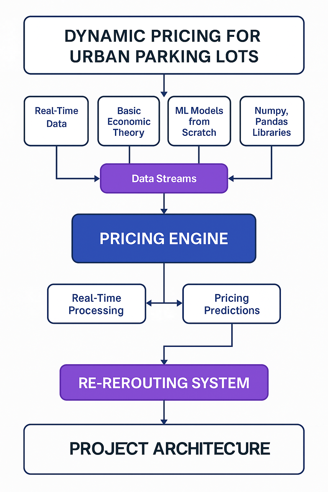
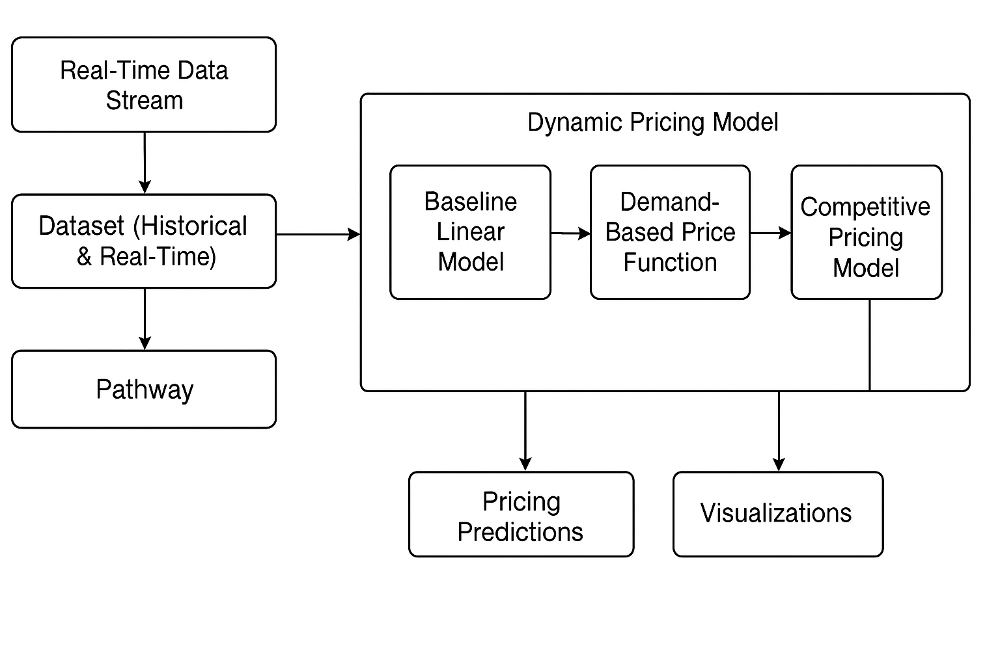

# Dynamic Pricing for Urban Parking Lots
*Capstone Project – Summer Analytics 2025*

**Author:** Jaiby Mariya Joseph

---

## Overview
Urban parking spaces often suffer from inefficiencies caused by static pricing. This project builds a **real-time dynamic pricing engine** for 14 parking spaces using demand factors such as:
- Occupancy
- Traffic congestion
- Queue length
- Vehicle type
- Special day indicators
- Competitor pricing (optional)

The solution ensures smooth, explainable, and adaptive pricing over time, leveraging real-time data streaming with Pathway and interactive Bokeh visualizations.

---

## Tech Stack
- **Python** (Data Processing & ML logic)
- **NumPy / Pandas** (data transformation)
- **Pathway** (real-time data simulation)
- **Bokeh & Panel** (interactive visualizations)
- **Matplotlib** (static plots for documentation)
- **FPDF** (PDF generation for reporting)

---

## Architecture Diagram


---

## Workflow Explanation


---

## Structure
```
├── dataset (1).csv              # Main dataset (73 days, 18 samples/day)
├── full_dynamic_pricing_code.py # Complete source code
├── Dynamic_Pricing_Final_Report_With_Outputs_Visuals.pdf # Final report
├── architecture_diagram.png     # Architecture diagram (to be generated)
├── workflow_diagram.png         # Workflow explanation diagram (to be generated)
└── README.md                    # Project readme file
```

---

##  How to Run
1. Clone the repo and place the dataset in the same directory.
2. Run the Python script (`full_dynamic_pricing_code.py`).
3. Make sure `pw.run()` is uncommented for real-time processing.
4. Outputs will be visualized using Bokeh and Panel.

---

##  Output Highlights
- Dynamic prices range from **$10 to $20** depending on demand.
- Real-time adaptation to vehicle type, traffic, and events.
- Rerouting logic can be built into Model 3 (proximity-aware pricing).
